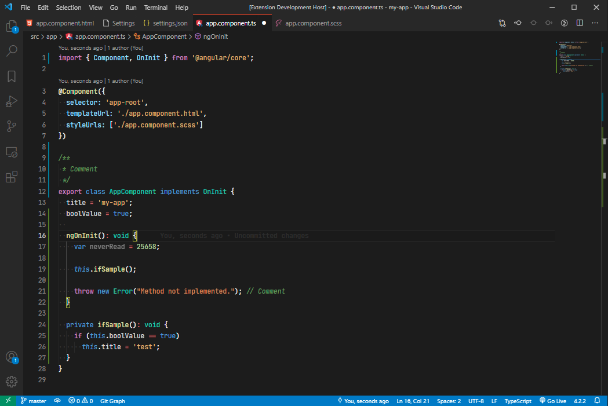
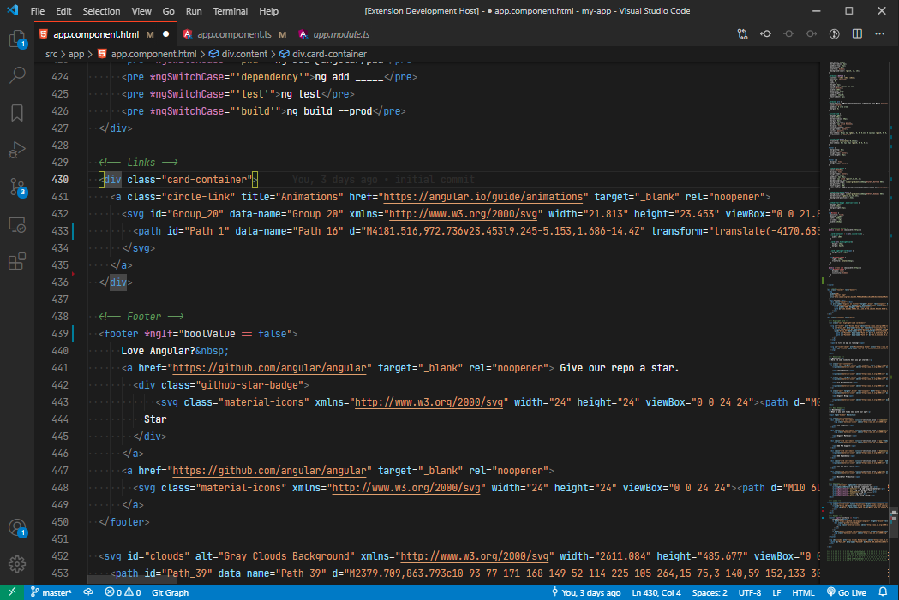
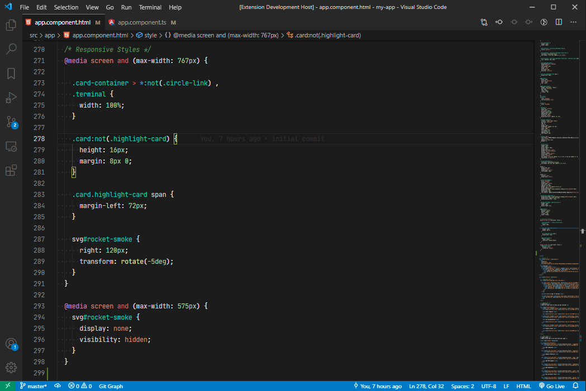

# Zuquini Theme

This extension for Visual Studio Code adds the dark theme: "Zuquini Theme".

> This is a simple theme created for my daily use, working with Angular.

## Images

**TypeScript**


**HTML**


**CSS**


## Installation

1. Open **Extensions** sidebar panel in Visual Studio Code. `View → Extensions`
2. Search for `Zuquini Theme`
3. Click **Install**
4. Click **Reload**
5. File > Preferences > Color Theme > **Zuquini Theme**

## Font

The font that you see in the demo is [JetBrains Mono Medium](https://www.jetbrains.com/lp/mono/), but [Fira Code](https://github.com/tonsky/FiraCode) works well too.

## Recommended settings for a better experience

```js
{
    // Controls the font family.
    "editor.fontFamily": "'JetBrains Mono Medium', 'Fira Code'",
    // Controls the line height.
    "editor.lineHeight": 23,
    // Enables font ligatures
    "editor.fontLigatures": true,
    // Controls if file decorations should use badges.
    "explorer.decorations.badges": false,
    // Removes tabs close button.
    "workbench.editor.tabCloseButton": "off"
}
```

## Credits

This theme was inspired by Visual Studio Dark+.

## Authors

Authored by [Adriel Zuquini](https://github.com/Zuquini).